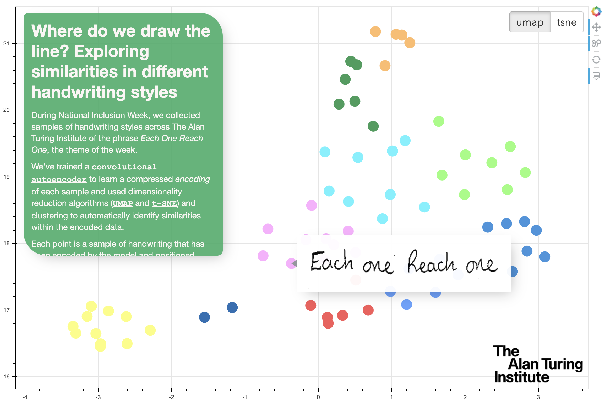

# Exploring similarities in handwriting styles

During National Inclusion Week, we collected samples of handwriting styles across the Institute of the phrase _Each One Reach One_, the theme of the week.
Just as various groups and characteristics exist within the Institute that people might not always be aware of, we were interested in exploring and visualising different styles of handwriting that might exist.

We utilised encodings from a convolutional autoencoder trained on the data to compute a representation of each sample that might be indicative of style.
We then used dimensionality reduction and clustering algorithms to explore and visualise similarities that exist amongst the writing samples.
We found that some samples did share similarities in style such as curliness or thickness of writing.

## Built With

- [TensorFlow](https://www.tensorflow.org/overview/) - data processing and model.
- [Scikit-learn](https://scikit-learn.org/stable/) - dimensionality reduction and clustering.
- [Bokeh](https://docs.bokeh.org/en/latest/index.html) - interactive scatterplot visualisation.
- [Jinja2](https://jinja.palletsprojects.com/en/2.11.x/) - injecting Bokeh visualisation into standalone html template.
